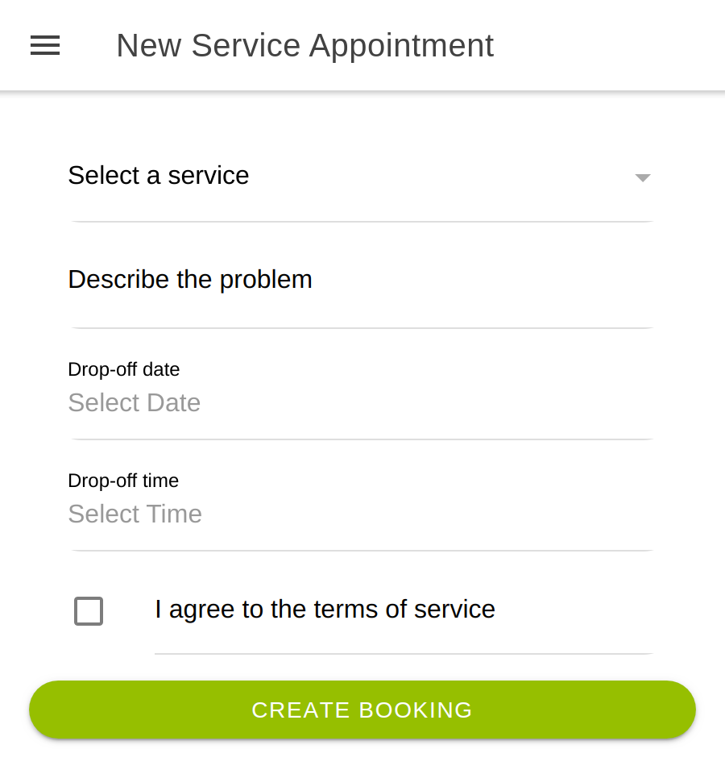
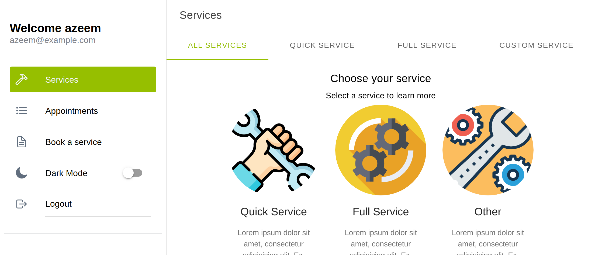

# Vehicle Service Booking

<!-- PROJECT LOGO -->

<br />
<p align="center">
  <a href="https://github.com/Azeem838/vehicle-service-booking.git">
    </p>
    <p align="center"> 
  </a>

  <h3 align="center">Vehicle Service Booking - React/Ionic in the front-end and a Rails-API in the back-end </h3>

  <p align="center">
    <a href="https://github.com/Azeem838/vehicle-service-booking/issues">Report a Bug or Request a Feature</a>
    ·
    <a href="http://azeemahmed.me/vehicle-service-booking/">Live Demo</a>
  </p>
</p>

<!-- Live Link  -->

### [Live Demo Link](http://azeemahmed.me/vehicle-service-booking/)

<br>
<!-- ABOUT THE PROJECT -->

## About The Project

This project follows the business requirements layout on [here](https://www.notion.so/Final-Capstone-Project-Book-an-Appointment-41ded2ee99ff4fe4becf91acb332ca26).
From these requirements, this app adapts the following workflow:

1. The user logs into the app by registering with their username, email and password
2. The user is presented with a list of services where more information can be viewed for each service
3. The user selects a service and access to the service details page
4. On the service detail page, the user can decide to reserve an appointment to service their car: the user has to select a date, time and add a description if necessary
5. There is a page to check the list of appointments of the user
6. You may toggle dark mode if you wish :smiley:

This app was built using the Ionic React framework therefore the app is fully respoinsive but works best on mobile.

The [Ruby on Rails back-end]() was built using Rails with 3 models:

1. Users Model
2. Appointments Model
3. Services Model

The app makes API requests while the user interacts with the app in order to retrieve the relevant information. The services database has been seeded with the various services since these services are assumed to be a finite number.

<!-- CONTROL'S -->

## Built With

- TypeScript
- React.js
- Redux
- Ionic Framwork
- JWT
- React Hook Form
- Jest
- Moment.js
- Eslint
- Webpack

## How to use

Users can:

- register and login to the account
- view list of services items and learn more about each service
- book a service on the service details page or by using the link in the side menu
- view their booking by navigating to the Appointment tab in the menu
- toggle dark mode in the menu

<!-- INSTALLATION -->

### Installation

To run the app locally, clone the repository and navigate to it's directory:

```bash
https://github.com/Azeem838/vehicle-service-booking.git
cd techStore
git checkout front-end-store
npm install
ionic-serve
```

Now go to [localhost:8100](http://localhost:8100) in your browser.

### Automated Testing 🧪

The app was test with jest, redux-mock-store and react-testing-library.

```bash
npm run test
```

## "Nice To Have Requirements" that are implemented

- Implemented proper user authentication from the front-end to the server
- Created a user table in the database, so that a given user can only access the favourites they selected
- Made the app responsive, created both tablet and desktop versions, following design guidelines
- Transitions were implemented to make the user experience better
- Created full documentation for the API
- Dark Mode via toggle

## Potential Updates

- More services and details
- Uses will be able to chat with their mechanic
- Payment functionality
- Email notification to remind the the users on their next service
- An admin panel to add services, specials

<!-- CONTACT -->

## Developer

:bust_in_silhouette: **Azeem Ahmed**

- Github: [@Azeem838](https://github.com/Azeem838)
- LinkedIn: [Azeem Ahmed](www.linkedin.com/in/azeemmahmed)

## Show your support

Give a ⭐️ if you like this project!

## Acknowledgments

Design influenced by [Murat Korkmaz on Behance](https://www.behance.net/muratk)

<!-- MARKDOWN LINKS & IMAGES -->
<!-- https://www.markdownguide.org/basic-syntax/#reference-style-links -->

## 📝 License

This project is [MIT](https://opensource.org/licenses/MIT) licensed.
